# Configure Docker Networking

## Docker Networking Overview

[https://success.docker.com/article/networking](https://success.docker.com/article/networking)

## Types of container networks
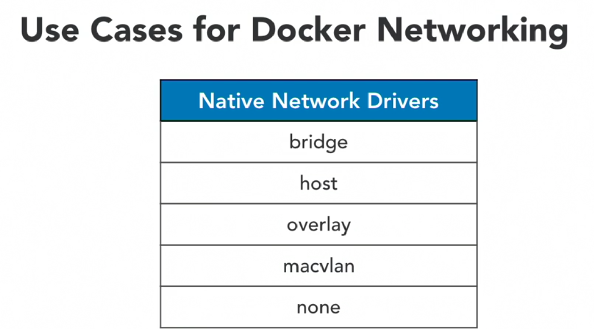
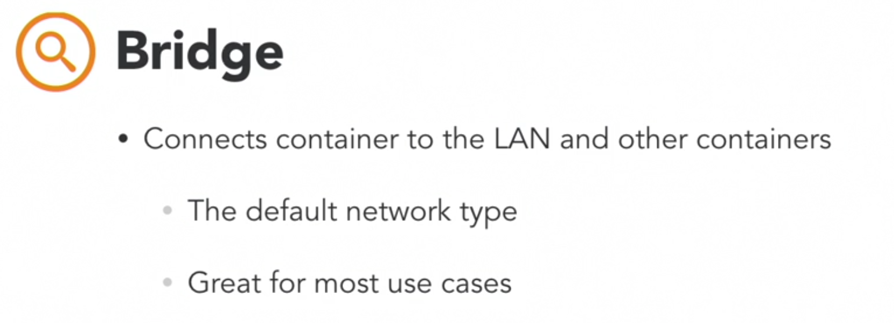
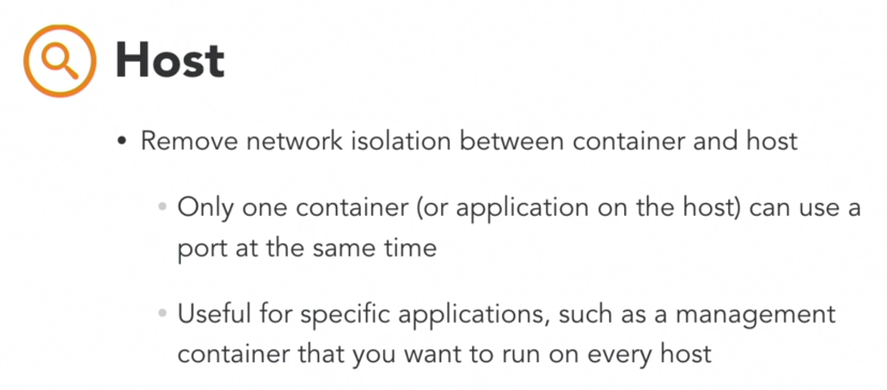
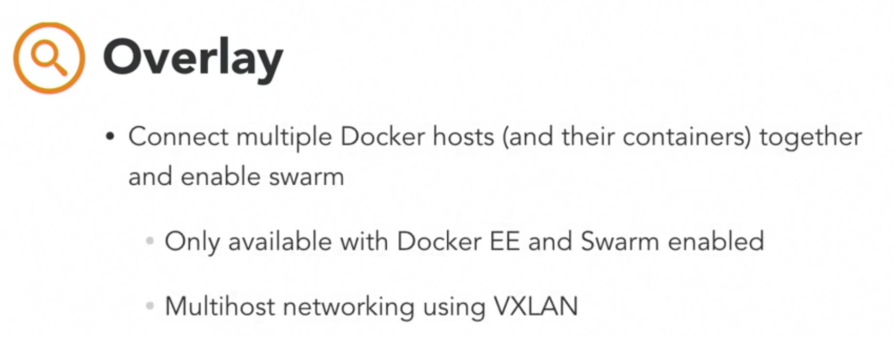
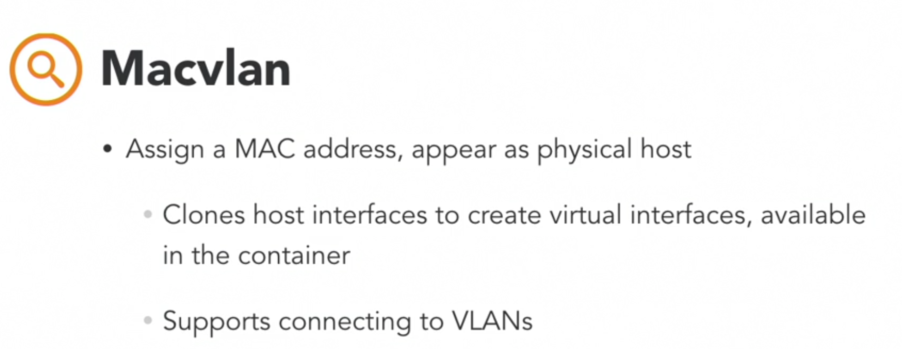
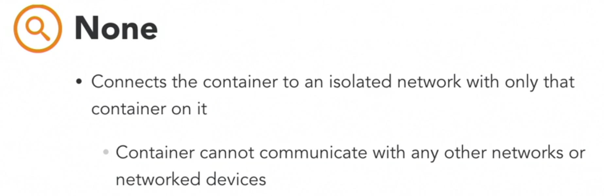
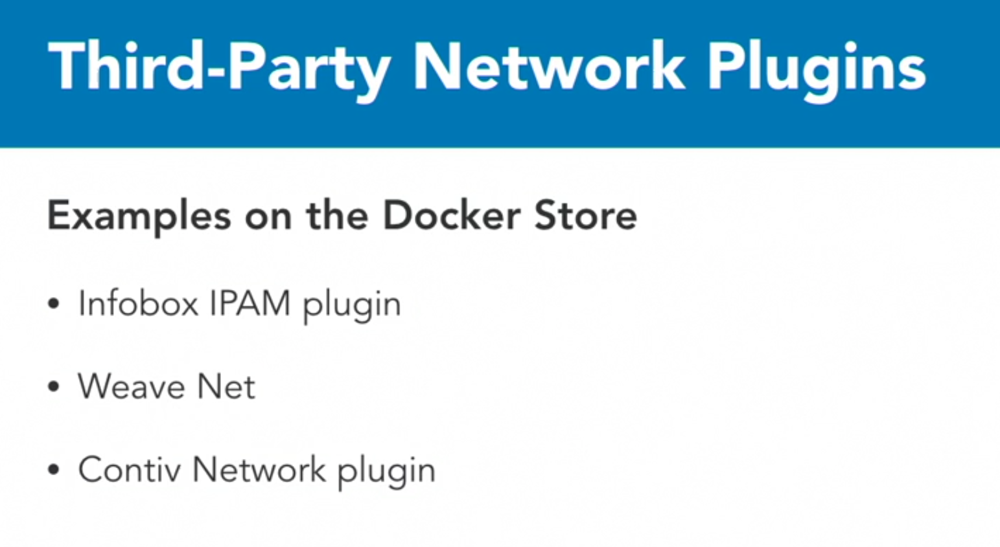


[https://blog.docker.com/2016/12/understanding-docker-networking-drivers-use-cases/](https://blog.docker.com/2016/12/understanding-docker-networking-drivers-use-cases/)

## Configure Docker Networking

### Configure a bridge network
```sh
docker network ls
docker network inspect | grep driver
docker network inspect | grep Subnet 
docker network inspect | grep Gateway 
docker network create --driver bridge <$network-name>
docker network <$network-name>
docker container attach <$container-id> ## run container in command line
```

### Create an overlay network

```sh
docker network create --driver overlay <$network-name>
docker service create --network=<$network-name> --replicas=6 nginx
```

### Publishing Ports
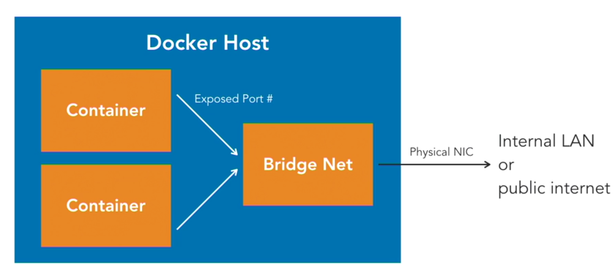
- By default, container are connected to a bridge network
- By default , containers have outbound network access but no inbound network access
- Ports must be Published to allow inbound  network access 
- [https://docs.docker.com/engine/reference/run/#expose-incoming-ports](https://docs.docker.com/engine/reference/run/#expose-incoming-ports)


### Comparing host and ingress port
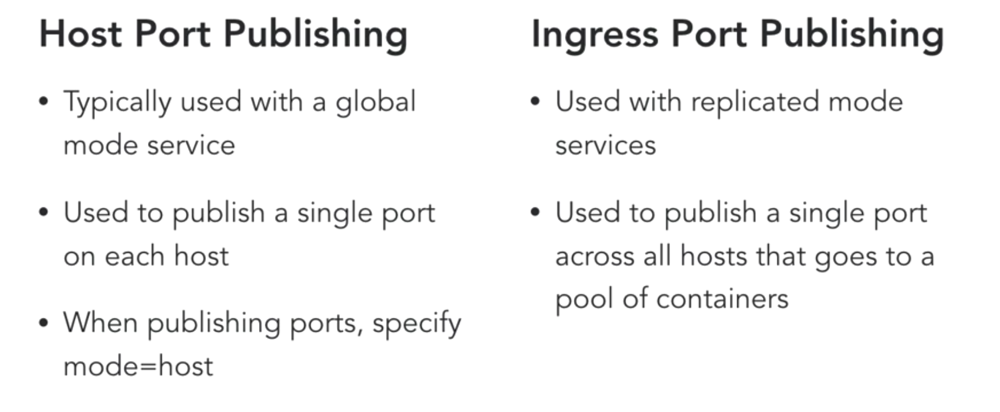
[https://docs.docker.com/engine/swarm/ingress/#bypass-the-routing-mesh](https://docs.docker.com/engine/swarm/ingress/#bypass-the-routing-mesh)

### Configure DNS
```sh
docker container run -it --dns 192.168.1.254 <image-id> /bin/bash ## this will set dns server in container  
cat /etc/resolv.conf 
```
- Another way to go about configuring DNS, and this would affect the entire docker host, is to actually go and edit, if we edit 
    ```
    sudo vi /etc/docker/daemon.json
    #in the file place 
    {
    "dns" : ["192.168.1.254"]
    }
    ```

### Configure Load balancing

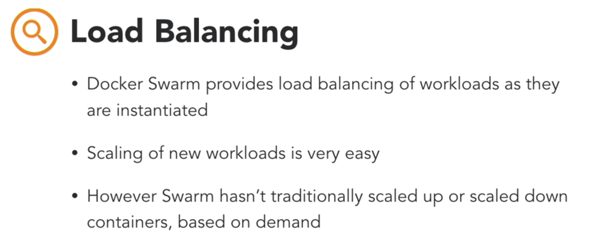
[https://success.docker.com/article/ucp-service-discovery](https://success.docker.com/article/ucp-service-discovery)

### Configure host networking 
 - [https://docs.docker.com/network/network-tutorial-host/](https://docs.docker.com/network/network-tutorial-host)

```sh
docker container run -d --network host nginx ## this uses host interface like ipaddr

```
### Understanding Docker EE traffic flow
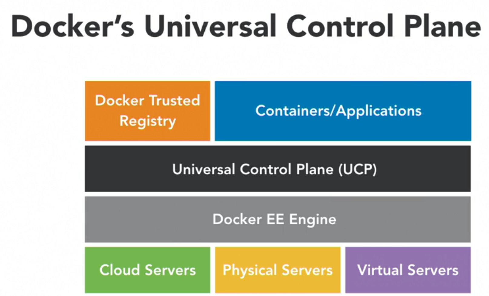
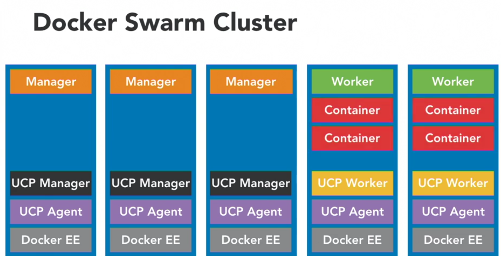
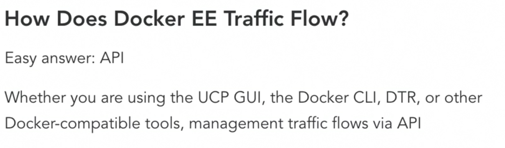

 - [https://docs.docker.com/ee/ucp/ucp-architecture/#ucp-components-in-manager-nodes](https://docs.docker.com/ee/ucp/ucp-architecture/#ucp-components-in-manager-nodes)
 - [https://docs.docker.com/ee/docker-ee-architecture/](https://docs.docker.com/ee/docker-ee-architecture/)

 ### Identifying external network ports

 ```sh
 docker container port $container-id
 docker container inspect $container-id | grep HostIp
 docker container inspect $container-id | grep HostPort

 ```

### Using logs to analyze network ports

 - [https://docs.docker.com/engine/reference/commandline/logs/](https://docs.docker.com/engine/reference/commandline/logs/)

```sh
docker container logs $container-id
```

