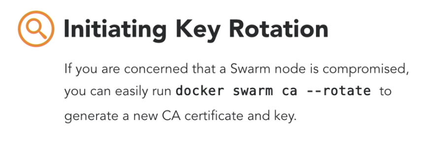

# Docker Security
## Understanding Docker Security
### Default Docker Engine Security


[https://docs.docker.com/engine/security/security/](https://docs.docker.com/engine/security/security/)

### Securing Docker Swarm

    - Mutually Authenicated Transfer Layer Security (MTLS) 
    




### Secure Docker to Registry Communincation

[https://success.docker.com/article/security-best-practices-17-03#dtrsecurity](https://success.docker.com/article/security-best-practices-17-03#dtrsecurity)

### Understanding Docker Content trust

    - Signing an image
[https://docs.docker.com/engine/security/trust/content_trust/](https://docs.docker.com/engine/security/trust/content_trust/)


```sh
docker tag nginx:latest <DTR-server or address>/ckoneru/test:<tagname>
export DOCKER_CONTENT_TRUST=1
```
## Configuring Docker Security
### Identifying roles in Universal Control Plane(UCP)


### Configuring Role-based access Control in UCP
 - [https://docs.docker.com/ee/ucp/authorization/pull-images/](https://docs.docker.com/ee/ucp/authorization/pull-images/)

### Using external certs with UCP and DTR
- [https://docs.docker.com/ee/ucp/admin/configure/use-your-own-tls-certificates/](https://docs.docker.com/ee/ucp/admin/configure/use-your-own-tls-certificates/)

### Creating UCP client bundles

- Go to UCP : Settings/Profile/Client Bundles/

### Using LDAP/AD with UCP
- Go to UCP : Admin setting/ Authentication&Authorization
[https://docs.docker.com/ee/ucp/admin/configure/external-auth/](https://docs.docker.com/ee/ucp/admin/configure/external-auth/)

### How to ensure images pass security scans

