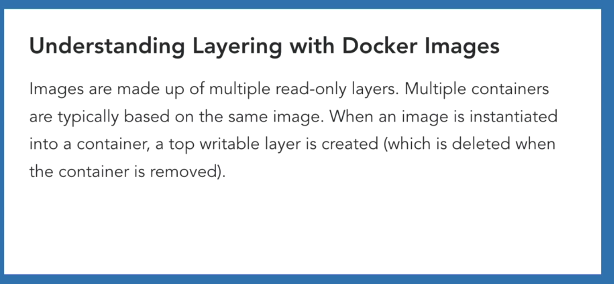
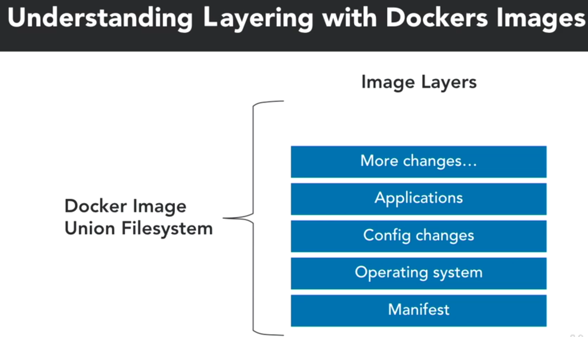
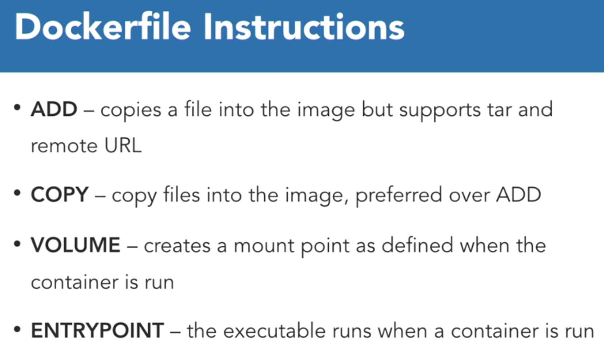
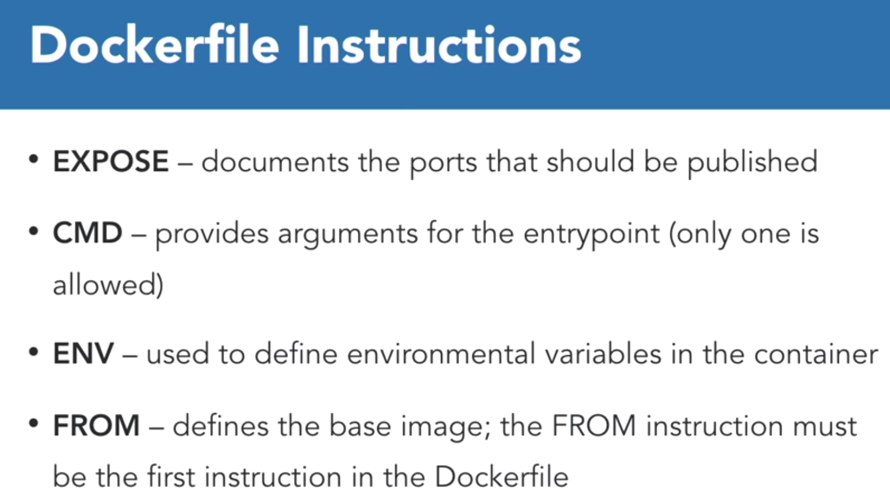
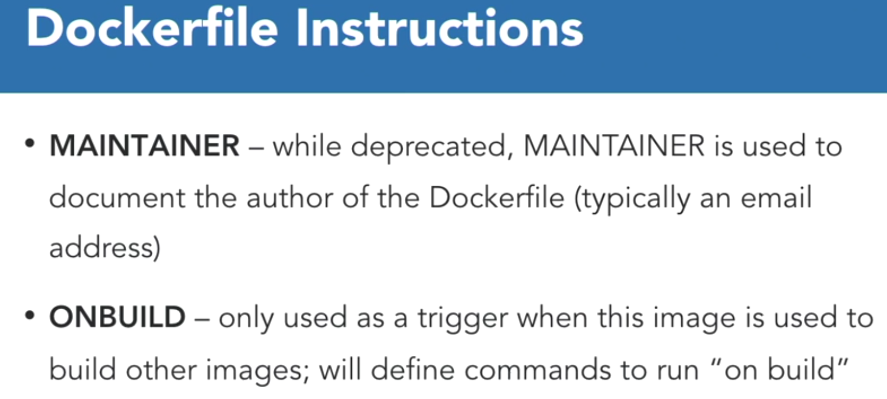
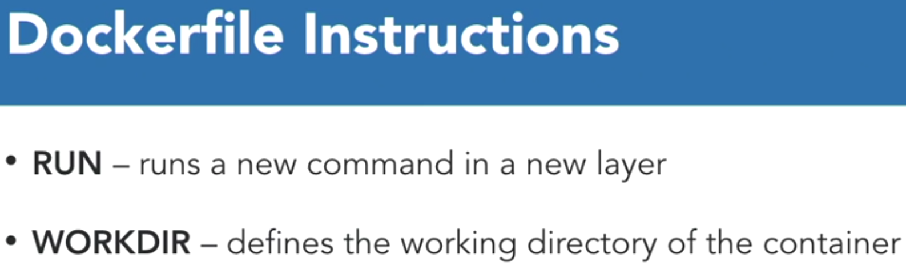
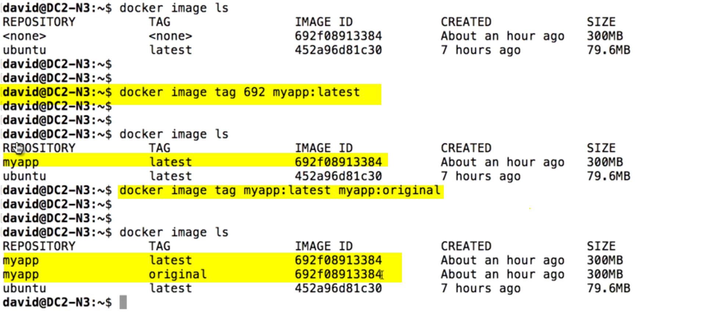
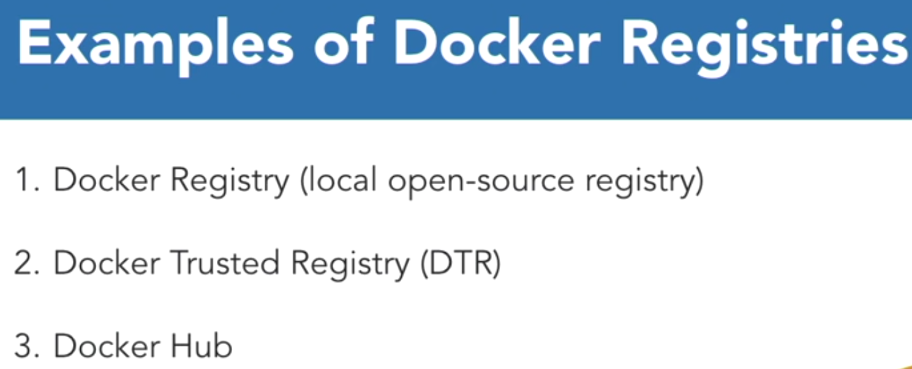

# Image Creation Management and Registry

## Understanding Docker Images

* an Image is an executable package that includes everything needed to run an application, including the code, a runtime, libraries, environmental variables and configuration files.

### Understanding Layes with Docker Images



* The Docker image union file system, as it's called, starts off at the bottom-most layer, with what they call a **manifest**. A manifest is, as you would expect, just like a container manifest on a container ship. This manifest is a document. In this case, it's a little bit of code, that describes what's inside the container. So, we start off with this description of the container. And then on top of that, you have the first container layer.



### Dockerfile

* A Dockerfile is a text file that contains all the commands in order, needed to build a given image. The Dockerfile is executed using the docker build command.

* [Dockerfile-reference](https://docs.docker.com/engine/reference/builder/) 

```shell
man dockerfile
docker image inspect <Image-id>
docker image history <Image-id>
```

### Dockerfile Instructions






### Managing images with the CLI

* **Dangling Images** - Dangling image is an image that was built, but doesn't have a tag

```shell
docker image <command>
docker image prune ## removes unused/Dangling images
docker image prune -a ## prunes all images that are unused by containers
```

## Managing Docker images

### Inspecting images

* [Docker-Image-inspect](https://docs.docker.com/engine/reference/commandline/image_inspect/)

```shell
docker inspect
docker image inspect <image> --format='{{.id}}' ##this will give id of image
docker image inspect <image> --format='{{json .ContainerConfig}}' ## will give container configuration in json format
docker image inspect <image> --format='{{.ContainerConfig.Hostname}} ## will give you the host name
```

### Using image tagging

* [Docker-Tags-Documentation](https://docs.docker.com/engine/reference/commandline/tag/)



### Creating an image from a file

* [Docker-Build-options](https://docs.docker.com/engine/reference/commandline/build/)
* [Best practices for writing Dockerfiles](https://docs.docker.com/develop/develop-images/dockerfile_best-practices/)
  
```shell
docker build -f <path to file > <path to dependency/build context dir>
docker build --squash -f <path to file > -t <tagName> <path to dependency/build context dir> # to merge layers to on elayer
docker container export $container_id > file.tar # To export a image or container to tar
docker image import file.tar
```

## Docker Registry

[Docker-Registy-doc](https://docs.docker.com/registry/)
[Docker-Registy-conf](https://docs.docker.com/registry/configuration/)

* Singning is feature for content trust in Enterprise edition

[Docker-Registy-signing](https://success.docker.com/article/introduction-to-docker-content-trust)

* Notary is feature for content trust in community edition

[Docker-notary](https://docs.docker.com/notary/getting_started/)

* Docker Registry is a stateless, highly scalable application that stores and lets you distribute Docker images. Registries could be local or private. They could also be cloud-based, which could be private or public.



### Docker search
```shell
docker search --filter "is-official=true" ubuntu ## get official versions
docker search --filter "stars=80" ubuntu # get images with atleast 80 sarts
docker search --filter "is-official=true" --filter "stars=80" ubuntu
```