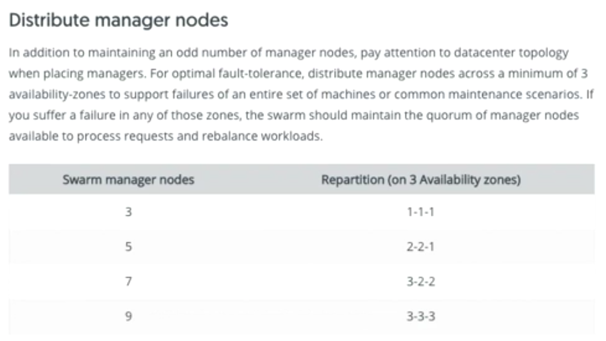

# Docker Essential Training: 2 Orchestration

## Getting started with Docker Swarm
### Intro to Docker Swarm
* Docker Swarm is available whether or not you have Docker Community Edition or Enterprise Edition. The Docker Swarm functionality comes from a separate project that Docker calls Swarmkit. A swarm cluster of Docker hosts or nodes, as they're called, is a highly available cluster of servers that runs in swarm mode. What's so powerful about Docker Swarm is that you can create what they call a service.
* For example, we could have a web server service with tens or even hundreds of web servers and define its desired state. For example, you could say that you want port 80 exposed for all the web servers, you could define the storage that all the web servers need and you could say that you always want to have, for example, 100 web servers running. Docker Swarm can take that service definition and act on it to ensure that it's always available.


### Set up a Docker Swarm
* [Setup-Docker-swarm](https://docs.docker.com/engine/swarm/)
* [Setup-Tutorial](https://docs.docker.com/engine/swarm/swarm-tutorial/create-swarm/)
```shell
docker swarm init ## to initialze the swarm
docker swarm join-token worker ## to add worker to swarm
```

### Nodes, services, containers, and tasks
* [deploy-service](https://docs.docker.com/engine/swarm/swarm-tutorial/create-swarm/deply-service)
```shell
docker service create --replicas <no. of replicas> --name <service-name> <docker-image-name>
```
* Difference btw container and services


### Locking a Swarm Cluster

* [lock-swarm-manager](https://docs.docker.com/engine/swarm/swarm_manager_locking/)

* Securing swarm is also important because of the ability for Docker to store and distribute secret keys for other applications with the Docker secrets feature. Any time that the Docker daemon restarts, the keys used to encrypt communication between nodes and the keys used to encrypt the logs on the disc are loaded. With Docker 1.13 and higher, you have the option to better protect the encryption keys used to access the swarm log by having the swarm managers require you to provide this key when they're restarted for security reasons.
```shell
docker swarm init --autolock ## when initialze
docker swarm update --autolock=true ## to enable autolock on existing cluster and it generate a key
docker swarm unlock-key ## to get the key . this only workes when the cluster is up and running . 
docker swarm unlock-key --rotate ## to get new key . 
```
* To unlock a swarm manager after it restarts, you have to run the the docker swarm unlock command and you must provide the key generate by `autolock`. Which of course will be different on different docker swarm clusters. It tells us to make sure that we remember this key or store it in a password manager which is more likely considering the length of the key since you won't be able to restart your Docker swarm managers without it.
* [docker_admin_guide](https://docs.docker.com/engine/swarm/admin_guide/)
* For those swarm cluster managers to be able to make those types of decisions, and ensure that the cluster's state is always healthy, they have to have something called quorum.


* [swarm-mode-raft-consensus](https://docs.docker.com/engine/swarm/raft/)



* to run manager only nodes
```shell
docker node update --availability drain <node>
```

## Managing Docker Swarm

###  Visualizing Swarm services
* [https://github.com/dockersamples/docker-swarm-visualizer](https://github.com/dockersamples/docker-swarm-visualizer)

### Analyzing services with Docker Inspect
* use 'docker inspect' to analyze services in Docker Swarm.
```shell
docker inspect
man docker inspect
docker inspect <service-id>
docker inspect <container-id>
```

### Understanding stacks and stack files
* Stacks are used to define complete multi-tiered, highly available, highly scalable applications to a swarm cluster.
*  So we start off with a web service. And that web service as we said, can contain multiple tasks, each which run containers across the Docker Swarm cluster. Let's say that we're deploying a complex, multi-tiered application.

We want it to be highly available and highly scalable across the cluster. This complex, multi-tier application is going to have more than just the web service tier. It's also going to have a database service and a reporting service, each made up of multiple tasks running multiple containers. We can define all of this inside what's called a Docker stack. The Docker stack defines these multiple services, each with multiple containers running inside, how all the networking services and storage services will be exposed, and how they're all related within the stack.

Once we define that stack, Docker Swarm will ensure that these multiple, interrelated services remain highly available, and their desired state that we've defined is constantly maintained. Let's look at it a different way. If we start off with a container, this container could contain a web server. And then from there, to scale our application, we need multiple containers running that same web server. We define those as a service.


### Stack File
* [More info on Stacks](https://docs.docker.com/get-started/part5/) 


```shell
docker stack
docker stack deploy --compose-file <yaml stack file> <name of the stack>
docker stack ls
docker stack ps
docker stack service <name of the stack>
```
### Manipulate a running stack of services
```shell
docker service update --replicas=20 <name of service > # to modify service in a stack
```
* you can also update the yaml file of the stack and run `docker stack deploy ` coimmand on the file

### Modifying network ports
* [Docker-Service-update](https://docs.docker.com/engine/reference/commandline/service_update/)

### Mounting Volumes
* [YAML_FOR_STACK_REF](https://docs.docker.com/docker-cloud/apps/stack-yaml-reference/)

```shell
docker volume ls
docker service update --mount-add type=volume,source=<name_of_source>,target=/<name_of_target> <name_of_service>
```

### Replicated vs global services
* [How_Swarm_mode_Works_For_Services](https://docs.docker.com/engine/swarm/how-swarm-mode-works/services/)
* [Docker-Service-update](https://docs.docker.com/engine/reference/commandline/service_create/)
* Global Service deploys a task in every node
```shell
docker service create --mode global --name <name of the service> <image name>
```

## Troubleshooting Docker Swarm
### Troubleshooting a service

* [Docker-Swarm-Sevice-logs](https://docs.docker.com/engine/reference/commandline/service_logs/)


### Using labels
* [swarm-mode-manage-nodes](https://docs.docker.com/engine/swarm/manage-nodes/)
* [Service-constraints](https://docs.docker.com/engine/reference/commandline/service_create/#specify-service-constraints---constraint)
* [Docker Reference Architecture: Designing Scalable, Portable Docker Container Networks](https://success.docker.com/article/networking)
* [Using templates with Docker services](https://docs.docker.com/engine/reference/commandline/service_create/#create-services-using-templates)

